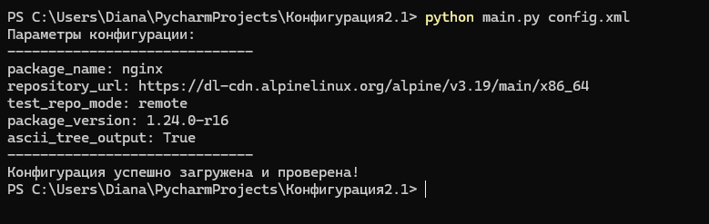

# Вариант №25 
Разработать инструмент визуализации графа зависимостей для менеджера 
пакетов. Готовые средства (менеджеры пакетов, библиотеки) для получения 
зависимостей использовать нельзя. 
## Этап 1. Минимальный прототип с конфигурацией 
### Общее описание
Цель: создать минимальное CLI-приложение и сделать его настраиваемым. 
#### Требования: 
1. Источником настраиваемых пользователем параметров является 
конфигурационный файл формата XML. 
2. К настраиваемым параметрам относятся: – Имя анализируемого пакета. – URL-адрес репозитория или путь к файлу тестового репозитория. – Режим работы с тестовым репозиторием. – Версия пакета. – Режим вывода зависимостей в формате ASCII-дерева. 
3. (только для этого этапа) При запуске приложения вывести все параметры, 
настраиваемые пользователем, в формате ключ-значение. 
4. Реализовать и продемонстрировать обработку ошибок для всех параметров. 
5. Результат выполнения этапа сохранить в репозиторий стандартно 
оформленным коммитом.
### Описание всех функций и настроек
#### Функции:
* parse_config(config_path) - парсит конфигурационный XML файл и возвращает параметры. Параметры: config_path (str) - путь к XML файлу конфигурации. Возвращает: dict - словарь с параметрами конфигурации.
* display_parameters(config) - выводит все параметры в формате ключ-значение. Параметры: config (dict)- словарь с параметрами конфигурации.
#### Настройки конфигурационного файла:
##### Обязательные параметры:
* package_name (str) - название анализируемого пакета.
* repository_url (str) - URL-адрес репозитория или путь к файлу.
##### Опциональные параметры:
* test_repo_mode (str) - режим работы с тестовым репозиторием. По умолчанию: "local".
* package_version (str) - версия пакета для анализа. По умолчанию: "1.0.0".
* ascii_tree_output (bool) - режим вывода зависимостей в формате ASCII-дерева. По умолчанию: False.
### Описание команд для сборки проекта и запуска тестов
Программа требует только стандартные библиотеки Python: xml.etree.ElementTree, sys, os. Тестирование проводится путем запуска приложения с передачей конфигурационного XML-файла в качестве аргумента командной строки.
### Тестирование

